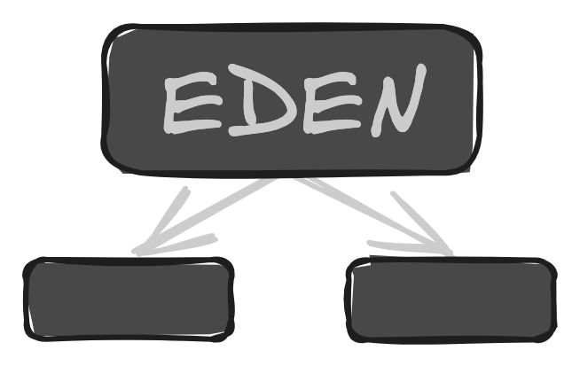

 

<h1 align="center" style="margin:0;padding:0;" >Behavior Eden</h1>

Behavior Eden是一款开源的Cocos Creator轻量级可视化行为树编辑器

## 背景

行为树是一个非常经典的用来实现复杂 AI 行为的工具，为了帮助大家提高对行为树的理解和使用能力，本项目通过非常少的代码实现了行为树的`Runtime`和`Editor`核心部分，并开放了所有的源代码，希望能对大家有所帮助。

## 安装（仅支持 Cocos Creator 3.8 以上）

- 方法一：下载插件源码（https://gitee.com/sli97/behavior-eden-coco-plugin.git）
  打成 zip 包，
  通过
  `Cocos`的`扩展管理器`导入。
- 方法二：通过`Cocos`官方商城安装，搜索`Behavior Eden`关键字并下载导入

## 使用

### 1、添加组件

打开`Cocos`项目，在场景中新建一个节点，搜索并添加`BehaviorTree`组件，同时会自动添加`BehaviorEditor`组件。

### 2、指定`JSON`文件

- 手动创建：新建空白`JSON`文件，并拖入组件的`asset`面板属性中
- 自动创建：点击`BehaviorEditor`组件的`Create / Editor`按钮，插件会在`asset`根目录生成当前节点同名`json`文件，并自动拖进
  `BehaviorTree`组件`asset`面板属性

### 3、行为树编辑界面

点击`BehaviorEditor`组件的`Create / Editor`按钮，会打开行为树编辑界面：

- 左边是行为树绘图界面
  - 左上角会根据用户的操作打印`warn`日志，可以收起展开
  - 中间有个`Root`根节点，不可编辑和移动
  - 右上角指定当前行为树编辑的`JSON`文件，对行为树界面的操作都会实时保存在文件中
- 右边是操作面板
  - `Node`面板可以添加行为树界面，包括`Composite`组合节点、`Decorator`装饰节点、`Condition`条件节点、`Action`行为节点
    点击节点就会在绘图区生成响应节点
  - `Inspector`界面可以编辑选中节点的属性，包括节点名称、节点中断类型、事件派发等

### 4、行为树搭建步骤

1. 点击`Node`面板的各个节点类型，即可创建节点
2. 点击节点右上角的`X`即可删除节点
3. 指定根节点：从`Root`节点下方面板拖出箭头，即可把所选节点设置为根节点
4. 设置子节点：同上
5. 解除父子关系：通过点击箭头处的`X`断开父子关系
6. 指定`Action`或者`Condition`事件触发场景节点、组件、方法、参数等属性来执行真正的逻辑，方法务必返回`NodeStatus`类型的节点状态
7. 自定义脚本可以通过`"db://behavior-eden/index"`路径引入插件暴露的类或者枚举
8. 自定义脚本可以通过`this.getComponent(BehaviorTree).enableBehavior()`或`disableBehavior()`来暂停和启动行为树
9. 可以设置中断类型`AbortType`来实现中断某个正在`Running`状态的节点
10. `BehaviorTree`可以设置`Restart When Complete`、`Start When Enabled`、`Pause When Disabled`、`Log Node Change`等面板属性
11. 退出面板，运行`Cocos`项目查看业务逻辑是否符合预期

## 开发

### 1、目录分析

### 2、补充类型文件

- `npm i`补充`fs`、`node`等模块类型
- `npm run watch`实时编译`ts`
- 修改代码后，在插件面板按下`ctrl + r`或者`command + r`查看修改是否生效
